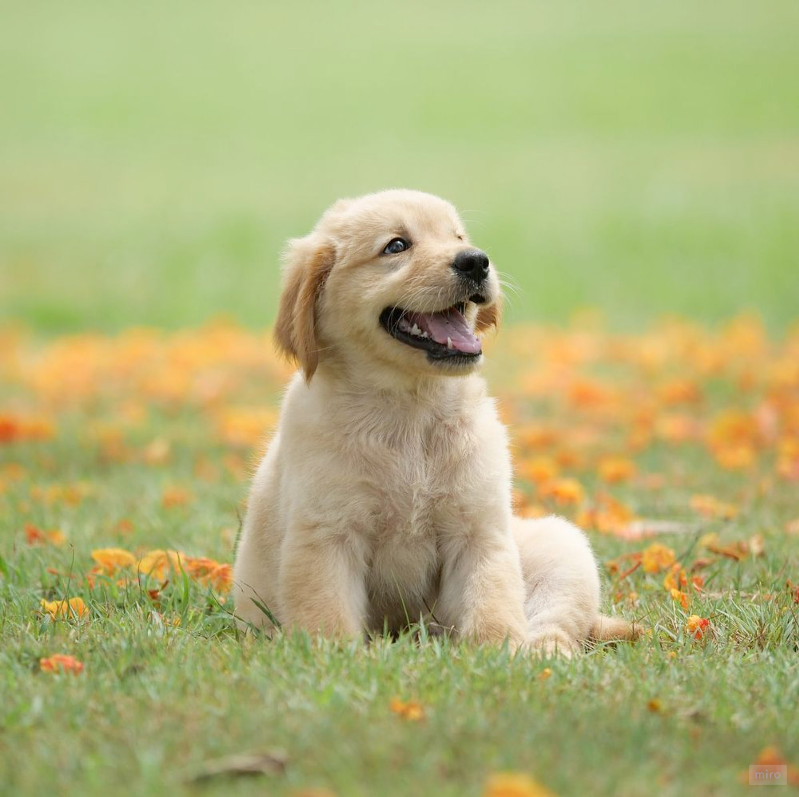
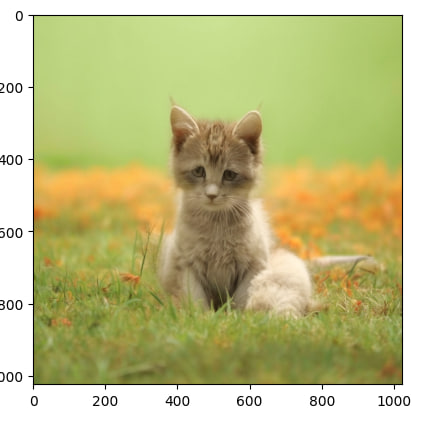

# dragon-diffusion-kandinsky3

DDIM Inversion example

Input Image                                                                    |  DDIM Inversedd
:-----------------------------------------------------------------------------:|:----------------------------------------------------------------------------:
   |  
