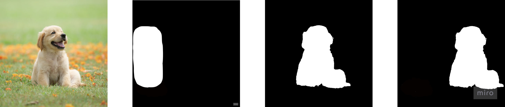
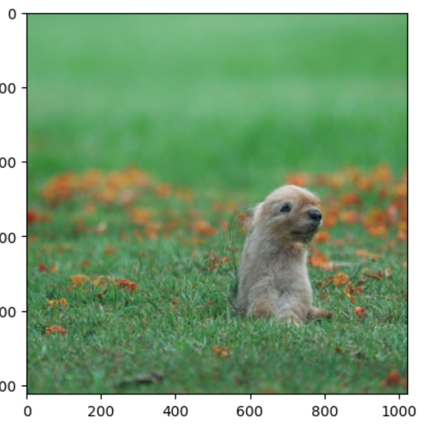
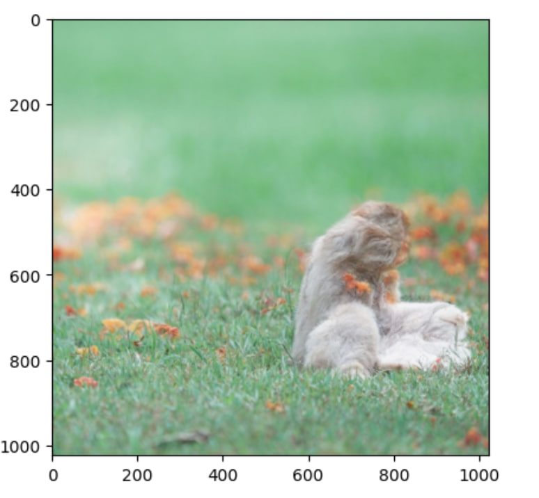
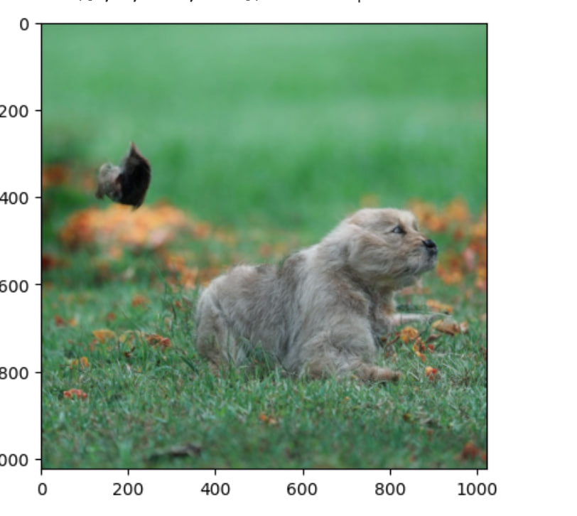

# dragon-diffusion-kandinsky3

## DDIM Inversion example

Input Image                                                                    |  DDIM Inversedd
:-----------------------------------------------------------------------------:|:----------------------------------------------------------------------------:
   |  

## Object moving

